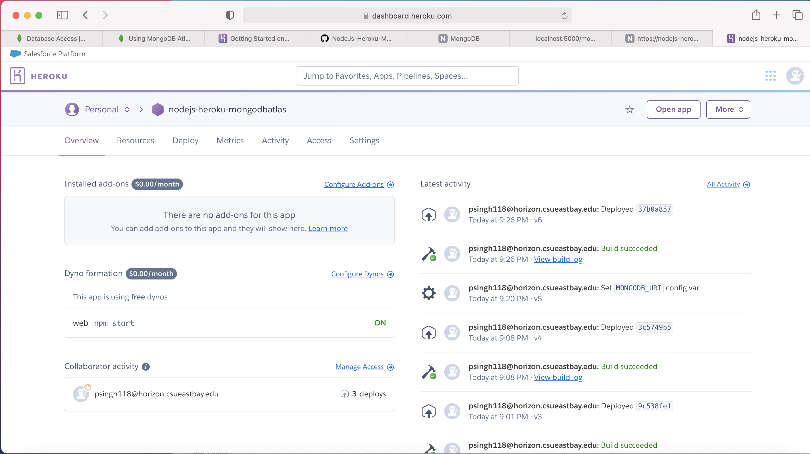
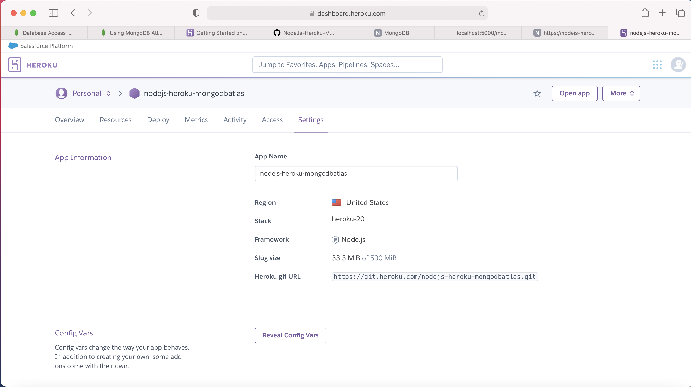
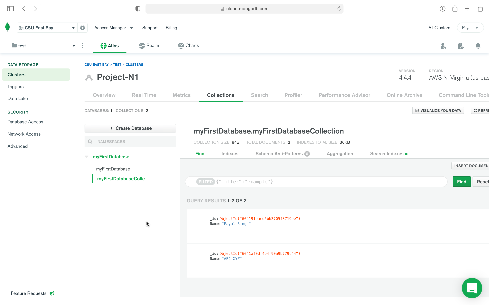
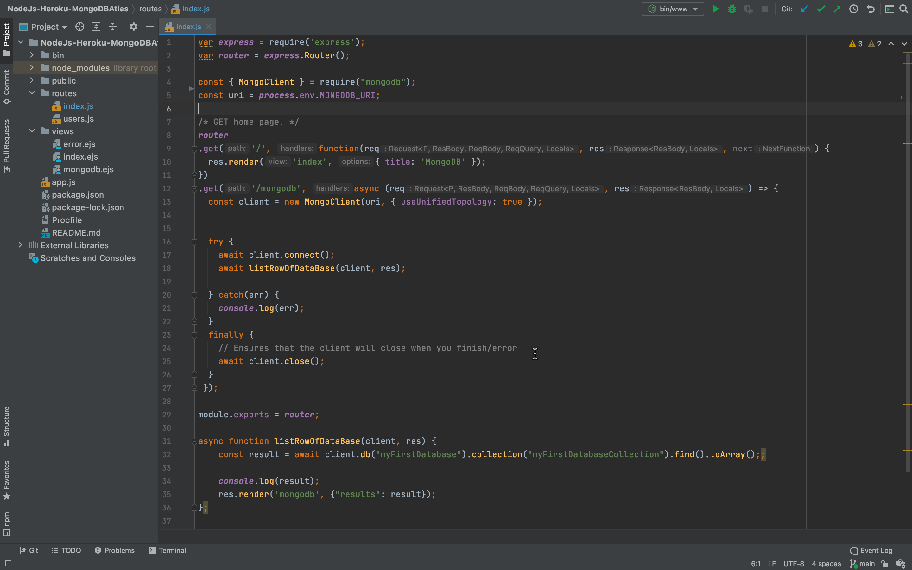
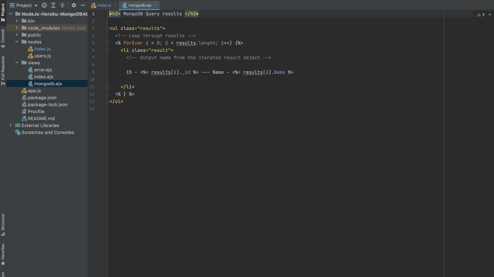
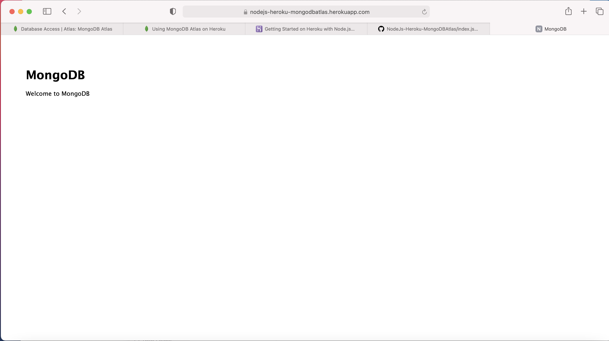
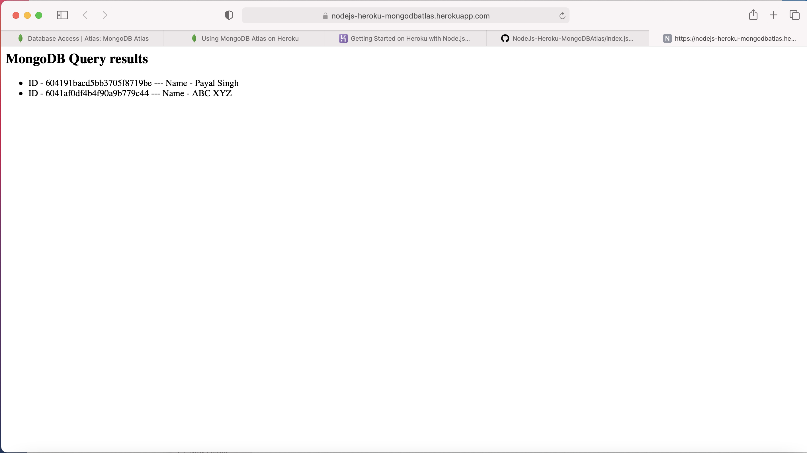

# NodeJs-Heroku-MongoDBAtlas

### Step by Step screen shot of NodeJS with Express and MongoDB on Heroku

- [App Runnning](https://github.com/singhpayalcsu/NodeJs-Heroku-MongoDBAtlas/blob/main/README.md#mongodb-atlas-query-results-with-nodejs-with-express-application-deployed-on-heroku)
- [DataBase Console](https://github.com/singhpayalcsu/NodeJs-Heroku-MongoDBAtlas/blob/main/README.md#mongodb-atlas-database)

### Heroku Images

### Mongodb Atlas Database

### index.js screenshot

### mongodb.ejs screenshot

### NodeJS with Express application Home page results deployed on heroku

### MongoDb Atlas Query results with NodeJS with Express application deployed on heroku

